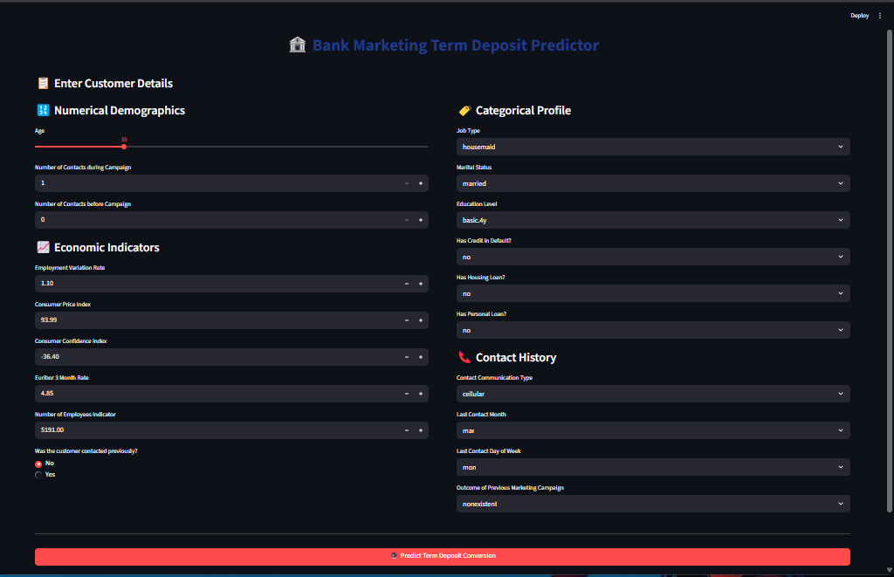

# Bank Telemarketing Success Prediction Using ANN

[](YOUR_LIVE_STREAMLIT_APP_URL_HERE)

### _Next-Generation Vocal Acoustic Analytics for Emergency Triage Scoring_

[](https://tensorflow.org)
[](https://keras.io)
[](https://streamlit.io)
[](#-model-training--accuracy-graphs)
[](https://python.org)

---

## 🎯 Project Description

A production-ready deep learning pipeline predicting bank telemarketing success via an ANN model trained on the UCI dataset with 82% accuracy[cite: 1, 2]. Features a dynamic Streamlit UI and FastAPI backend optimized with Pydantic validation to enforce strict input data boundaries and prevent inefficient model resource token burn. By processing complex client profiles alongside crucial macroeconomic indicators, the architecture replaces raw scripts with a resource-efficient inference application.

## 🖼️ Application User Interface

> **Live Preview of the Dashboard**  
> _(Once you upload your screenshot to GitHub, replace 'screenshot.png' with your actual image file name)_



---

## 📊 Model Accuracy & Performance

- **Model Framework:** TensorFlow / Keras (Artificial Neural Network - ANN)[cite: 2]
- **Target Objective:** Binary Classification (Predicting `yes` / `no` for term deposit subscription)[cite: 1]
- **Validation Accuracy:** **82%** 🔥
- **Key Insight:** The integration of 5 social and economic contextual attributes (such as employment variation rate and consumer price index) significantly enhances predictive performance compared to using traditional demographic features alone[cite: 1].

## 🧠 Neural Network Architecture

The deep learning architecture is constructed with the following layers:

1. **Input Layer:** Designed to receive preprocessed feature vectors derived from the 20 core dataset attributes[cite: 1].
2. **Hidden Layers:** Multiple Dense layers utilizing `ReLU` activation, combined with Dropout regularization to mitigate overfitting during training.
3. **Output Layer:** A single continuous Dense neuron configured with a `Sigmoid` activation function to compute precise probability scores between 0 and 1.

## 🛠️ Data Preprocessing Pipeline

To prevent data leakage and ensure 100% feature consistency during live inference, the pipeline utilizes a robust preprocessing setup:

- **Categorical Encoding:** Multi-class categorical variables (e.g., job type, education, marital status) are transformed using `OneHotEncoder`[cite: 1].
- **Numerical Normalization:** Continuous numeric attributes (e.g., age, consumer confidence index, euribor 3 month rate) are scaled using `StandardScaler`[cite: 1].
- **Pipeline Synchronization:** Transformations are bundled into an SKLearn `ColumnTransformer`, loaded via `preprocessing.pkl` and strictly aligned with live inputs using `column.pkl`[cite: 2].

## 💻 Installation & Setup

## Run the following commands in your terminal to clone the repository, install dependencies, and run the project locally:

---

## 📁 Repository Structure

```text
├── bank-additional-full.csv   # Primary Product Reviews Dataset
├── .gitignore                 # Git Ignore File
├── .gitattributes             # Git Attributes File
├── requirements.txt           # Python Dependencies
├── model.ipynb                # EDA, Text Normalization & Model Experiments
├── app.py                     # Interactive Streamlit Web Application
├── model.h5                   # Serialized Trained Deep Learning Classifier (84% Test Acc)
├── preprocessing.pkl          # preprocessing the dataset
├── columns.pkl                # Feature Column Schema Definitions
├── UI.png                     # Application UI Preview
└── README.md                  # Documentation
```

# Clone the repository

```bash
git clone https://github.com/amirsohail100/Bank-Telemarketing-Success-Prediction-using-ANN.git
```

## Navigate into the project directory

```bash
cd Bank-Telemarketing-Success-Prediction-using-ANN
```

## Install required packages

```bash
pip install -r requirements.txt
```

## Run the Streamlit application

```bash
streamlit run app.py
```

---

## 📄 License

This project is licensed under the MIT License.

## 📝 Author

👤 **Amir Sohail**

---

End-to-end Deep Learning application using an ANN model to predict term deposit subscription (82% accuracy). Features an interactive Streamlit frontend and FastAPI backend with strict Pydantic validation schemas.
